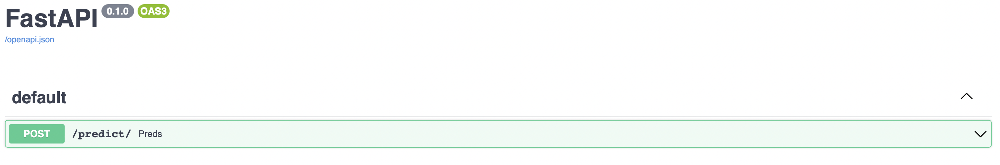
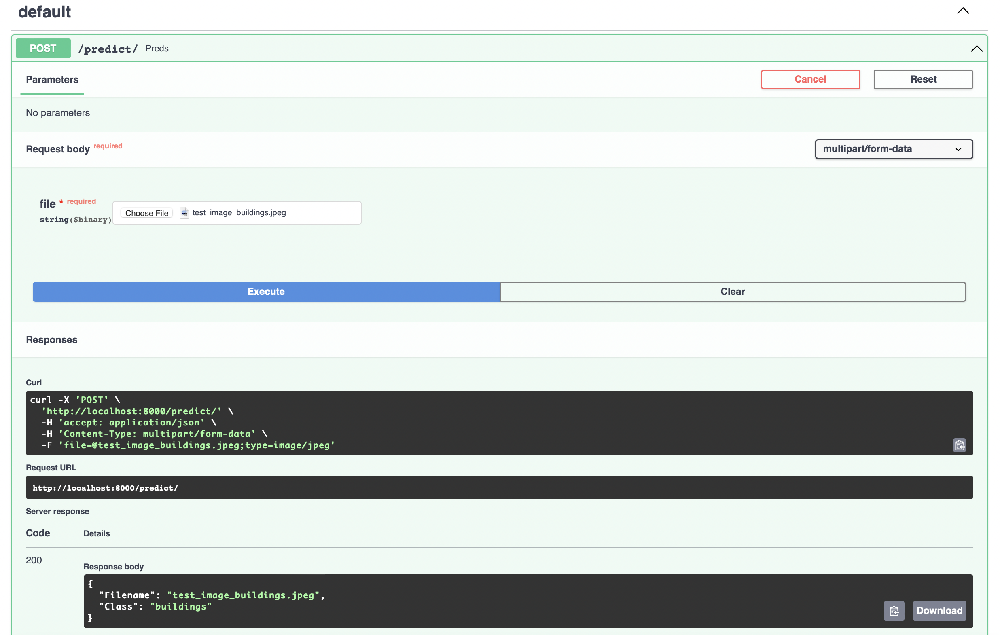

<p align="center">
  <a href="https://fastapi.tiangolo.com"></a>
</p>

# Image Classification API using FastAPI and Tensorflow

<kbd>Dataset link</kbd> : https://www.kaggle.com/datasets/puneet6060/intel-image-classification
## Usasge

- to run the api
```bash
$ uvicorn app:app --reload --port 8000
```
- to run the inference
```bash
python predictions.py <path_to_image>
```

## Results
Testing the API using FastAPI swagger UI
- run the api using the below command
```bash
$ uvicorn app:app --reload --port 8000
```
- our API will be running on the `http://localhost:8000/`. to open the swagger UI provided by FastAPI add `/docs` at the end of the link. `localhost:8000/docs`
<p align="center">
  <a href="#"></a>
</p>
- if we open the predict endpoint and click on try it out.
<p align="center">
  <a href="#"></a>
</p>
- we can see the class and name of the image in the response body of the swagger UI


